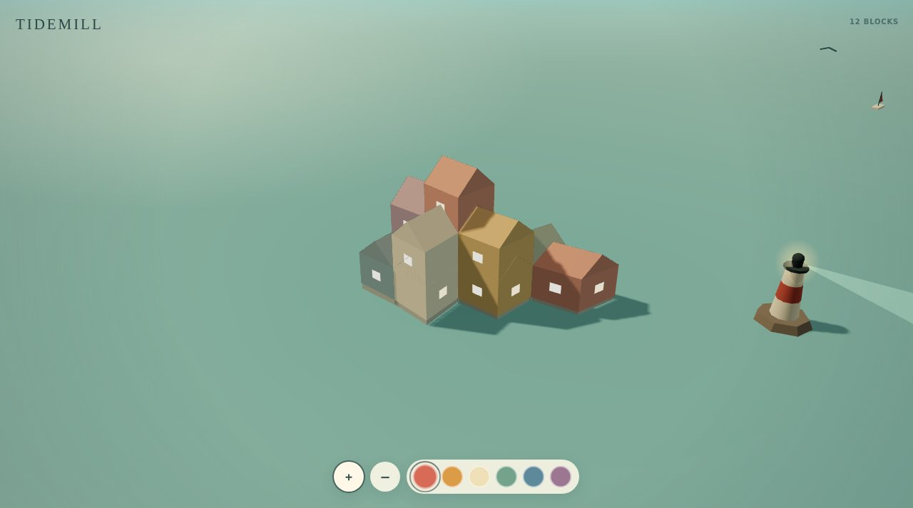

# Tidemill

A calm procedural toy-town builder.



**Live:** https://aeiouvcode.github.io/tidemill/

## About

Tap the water to place blocks and a small harbor town grows around them: houses, roofs, a lighthouse. Drag to orbit, zoom with + and -, and change the palette. There is no score and no timer.

## Built with

Three.js r160 (ES module from jsDelivr) and Web Audio in one `index.html`.

## Run locally

```sh
git clone https://github.com/aeiouvcode/tidemill.git
cd tidemill
python3 -m http.server 8000
```

Then open http://localhost:8000.

An internet connection is needed on first load for the Three.js module.
